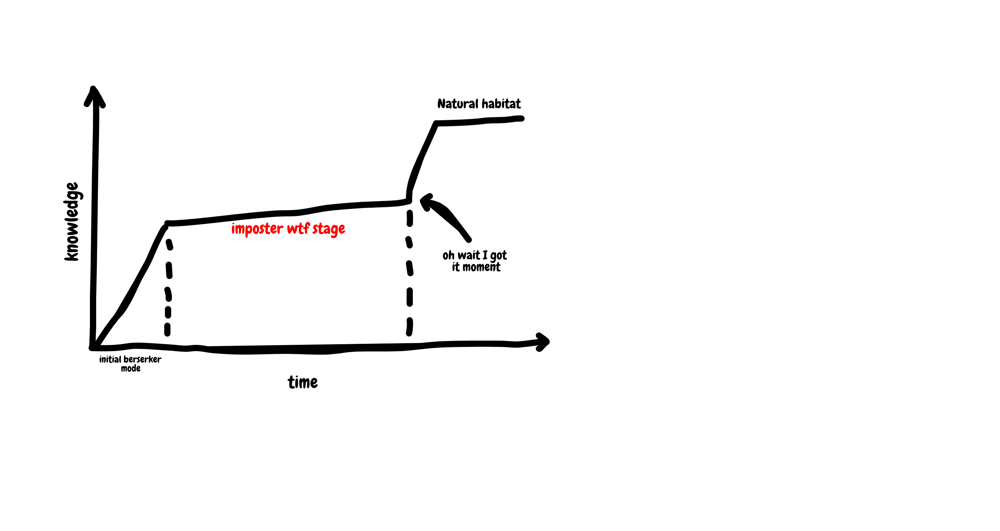

# Jose Pablo Wenzel
=======

I'm Jose Pablo, a Chilean software craftsman. I'm driven by fun, yes you read that correctly, I enjoy working in fun enviroments and I'll do everything in my power to make others have a fun time working with me, I can be a little slow in showing this side of me, and that will come only with time and how open you are to me. I'm always worried that I'll offend you, so if I ever do, please accept my apologies. I'm good with change and new challenges, but my learning curve is particular and better explained with a doodle: 

Please have patience in my imposter wtf stage.

## Work preferences

I enjoy working in the morning. That's when I get most of the work done. Late noon I'll get a little worn out. That is why I always block my last hour of work to cool down or do work that is less mind-intensive. Don't worry about booking a meeting at the end of my day regardless, I'll happily help and work with you. I tend to be a little disorganized with my time. Because of this, calendars are my best friends, so I use them to get my attention. I will most definitely book my calendar for daily work, so it might look like many meetings, but it is just me organizing myself.

I don't mind tight deadlines, I'm willing to do the extra work, but if so, I expect you to be mindfull of the extra workload I've taken.

## How to communicate with me

By default, you are an honest person to me, so I'll always believe in what you say. I expect you to come to me with respect and courage, you can respectfully say to my face to f#*k-off, I won't take offense to that. If we disagree, we can always come to a middle ground closer to yours. I tend to be a little too pleasing (I'm working on that). If you have a strong opinion on something and I don't, I'll probably agree with you. I never have strong opinions, only when it comes to people.

## Decisions

If I'm doing the job, I want to have a say on it. Even if the work has nothing to do with what I envisioned, I believe that all of us should discuss the best way to tackle our problem. only by having everyone's opinion we can make an informed decision

## My beliefs

I think that deep under, everyone loves to play. So as I mentioned earlier, I'll always joke and try to make the workspace as informal as possible. I really think that gamification is the best way to work and live (my wife thinks it is a little too much whenever I try to remember the shopping list out of the top of my head so I can tick all of them out).

## My issues

- I will likely feel that you are smarter than me. This is something deeply rooted in me. I have worked in it, and I acknowledge it. ([read more on my post](https://elartesano.herokuapp.com/imposter-syndrom-tips/))
- Reading is not my forte. If something is very long I'll likely answer: "do you have a TLDR?".

## What I don't have patience for

I'm a very patient person, so it's improbable for me to lose my temper. But when it comes to unmet commitments, you might see me a little displeased. I'm a very respectful person with people's time, so I hope that you respect mine as well.

## Feedback

Like everyone, I love positive feedback. But I always expect negative feedback. Once we're in the feedback zone, I will rarely be offended, and I'll give you all the allowances to explain yourself and make up your mind in the process. People sometimes start talking without a clear idea and work it out in the process. I enjoy that process and encourage it, so just go ham, and we'll figure it out.

## Me outside the office

I spend an unhealthy amount of time on youtube, another unhealthy amount of time playing videogames. But when I'm not on the computer, I love to swim, spend time with my wife, and play games in my mind (Would you rather?... If I had 3 wishes?... What if the world really is ...)
